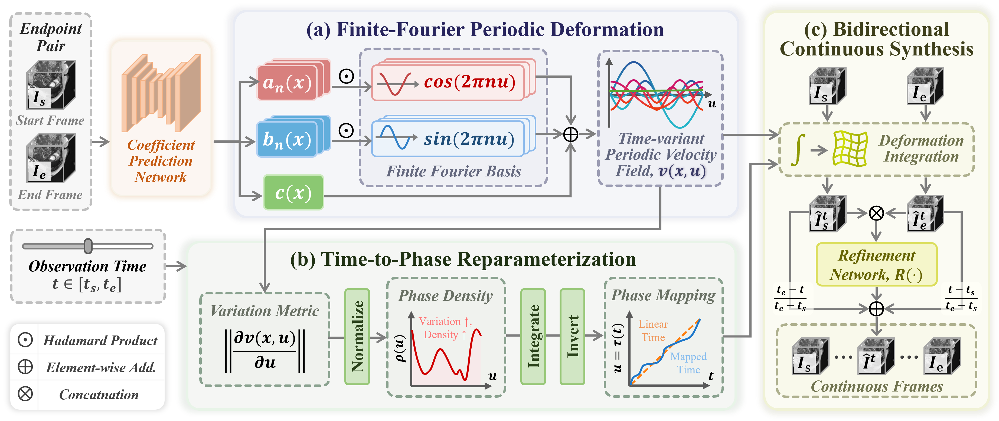
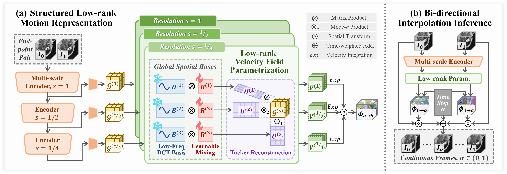

# PAFF & LRVF: 4D Medical Image Interpolation

Official PyTorch implementation of two methods for continuous 4D medical image interpolation:

- **PAFF**: **Phase-Aligned Finite-Fourier Periodic Deformation for 4D Medical Image Interpolation**, accepted by **ACM Multimedia 2026**.
- **LRVF**: **Low-Rank Velocity Fields as a Structural Prior for Unsupervised 4D Medical Image Interpolation**, provisionally accepted by **MICCAI 2026**.

Both methods synthesize intermediate 3D volumes from two observed endpoint volumes, but use different motion priors and supervision settings:

| Method | Training supervision | Motion representation |
| --- | --- | --- |
| PAFF | Endpoint inputs with intermediate-frame supervision | Phase-conditioned continuous velocity field parameterized by a finite Fourier basis |
| LRVF | Endpoint-only unsupervised training | Multi-scale Tucker low-rank stationary velocity fields |

## PAFF

PAFF models interpolation as a continuous, phase-structured deformation process. Given an endpoint pair, the network predicts spatial Fourier coefficient fields once and evaluates a phase-conditioned velocity field at arbitrary query times. A deformation-derived time-to-phase mapping accounts for non-uniform physiological motion. Intermediate volumes are produced through bidirectional deformation integration, time-aware endpoint fusion, and lightweight residual refinement.

Key components include:

- finite-Fourier periodic deformation with a constant term and four harmonic orders;
- phase-aligned temporal reparameterization driven by deformation variation;
- bidirectional continuous endpoint warping;
- phase-cycle consistency and frequency-aware spectral regularization;
- residual refinement of the fused prediction.



## LRVF

LRVF performs endpoint-only unsupervised interpolation by constraining motion to structured Tucker low-rank velocity-field spaces. It separates globally shared spatial bases from compact sample-specific cores and predicts motion at coarse, middle, and fine resolutions for anatomically coherent coarse-to-fine deformation.



## Environment

The code is implemented with PyTorch. A typical environment includes:

- Python 3
- PyTorch with CUDA support
- nibabel
- numpy
- scipy
- scikit-image
- torchmetrics
- tqdm
- visdom, optional for training visualization

## Datasets

The papers evaluate on:

- ACDC: https://www.creatis.insa-lyon.fr/Challenge/acdc/
- 4D-Lung: https://www.cancerimagingarchive.net/collection/4d-lung/

The preprocessing protocol used in both papers is:

| Dataset | Split | Resized volume | Endpoint frames |
| --- | --- | --- | --- |
| ACDC | 80 / 20 / 50 cases | `160 x 160 x 16` | End-diastolic and end-systolic phases |
| 4D-Lung | 306 / 84 / 110 volumes, split at patient level | `128 x 128 x 32` | 0% and 50% respiratory phases |

All volumes are histogram-equalized and linearly normalized to `[0, 1]`.

The dataloader expects each split to be organized as:

```text
<DATA_ROOT>/
  0/
    video.nii.gz
    info.json
  1/
    video.nii.gz
    info.json
  2/
    video.nii.gz
    info.json
  ...
```

Each `video.nii.gz` contains one 4D sequence and is loaded as `T x 1 x D x H x W`.

Each `info.json` provides the endpoint indices:

```json
{
  "n_first_frame": 0,
  "n_last_frame": 1
}
```

For PAFF, the intermediate frames are used as training targets but are never supplied as network inputs. For LRVF, only the endpoint volumes are used for training.

## PAFF Usage

Replace `<TRAIN_ROOT>`, `<VAL_ROOT>`, `<TEST_ROOT>`, `<GPU_ID>`, `<PORT>`, and `<RUN_ID>` with local values. If `--secondary_dirname` is omitted during training, the framework creates a timestamped run directory.

### Paper-aligned settings

The PAFF experiments use AdamW with an initial learning rate of `2e-4`, cosine annealing, batch size `1`, and gradient accumulation over `8` iterations. ACDC is trained for `500` epochs and 4D-Lung for `200` epochs, both with early stopping.

The PAFF model configuration follows the paper:

- Fourier truncation order: `N = 4`
- Fourier coefficient regularization exponent: `gamma = 1.5`
- NCC loss window size: `7`
- Charbonnier weight inside the morphing loss: `lambda_charb = 10`
- Gradient loss weight in refinement: `lambda_grad = 1`
- Overall loss weights: `lambda_morph = 1`, `lambda_cycle = 1`, `lambda_refine = 5`, and `lambda_reg = 0.005`
- Phase-density stabilizer: `epsilon = 1e-6`

The commands below assume that PAFF-specific settings not explicitly exposed as command-line arguments use these values as model defaults. The paper does not specify the AdamW betas, epsilon, weight decay, warmup ratio, cosine minimum learning rate, or gradient-clipping threshold; the commands retain the supplied repository values for these implementation details.

### Training

The following command corresponds to the ACDC setting. For 4D-Lung, set both `--epochs_num` and `--lr_scheduler_T_max` to `200`.

```bash
python procedures/train.py \
  --model_name paff \
  --input_nc 1 \
  --output_nc 1 \
  --dataset_name video \
  --preprocess \
  --batch_size 1 \
  --optimizer adamw \
  --optimizer_betas 0.9 0.99 \
  --optimizer_eps 0.00000001 \
  --optimizer_weight_decay 0.0001 \
  --optimizer_lr 0.0002 \
  --set_bias_norm_zero_weight_decay \
  --lr_scheduler cosineannealinglr \
  --epochs_num 500 \
  --lr_scheduler_T_max 500 \
  --lr_scheduler_eta_min 0.000005 \
  --warmup_percentage 0.1 \
  --save_epoch_freq 10 \
  --name paff \
  --secondary_dirname <RUN_ID> \
  --display_port <PORT> \
  --is_3d \
  --data_dirname <TRAIN_ROOT> \
  --grad_accum 8 \
  --clip_norm 1 \
  --loss_ncc_window_size 7 7 7 \
  --loss_morph_charb_weight 10 \
  --loss_refine_weight 5 \
  --fourier_use_constant_term \
  --refinement_do_residual \
  --gpu_ids <GPU_ID>
```

### Validation

Validation scans checkpoints in `results/paff/<RUN_ID>/train/checkpoints`, evaluates them, and copies the best checkpoint as `best_*`. The command uses NCC for checkpoint ranking as a repository convention because the paper does not specify the early-stopping metric.

```bash
python procedures/validation.py \
  --phase val \
  --model_name paff \
  --input_nc 1 \
  --output_nc 1 \
  --dataset_name video \
  --batch_size 1 \
  --preprocess \
  --metrics_list ncc \
  --metrics_as_sort_index ncc \
  --metrics_sort_mode max \
  --ncc_window_size 9 \
  --ncc_do_square \
  --is_3d \
  --name paff \
  --data_dirname <VAL_ROOT> \
  --fourier_use_constant_term \
  --refinement_do_residual \
  --secondary_dirname <RUN_ID> \
  --gpu_ids <GPU_ID>
```

### Testing

The PAFF paper reports PSNR, NMI, and SSIM.

```bash
python procedures/test.py \
  --model_name paff \
  --input_nc 1 \
  --output_nc 1 \
  --dataset_name video \
  --preprocess \
  --batch_size 1 \
  --metrics_list psnr nmi ssim \
  --ncc_window_size 9 \
  --is_3d \
  --name paff \
  --data_dirname <TEST_ROOT> \
  --gpu_ids <GPU_ID> \
  --load_epoch best \
  --refinement_do_residual \
  --fourier_use_constant_term \
  --secondary_dirname <RUN_ID>
```

## LRVF Usage

### Training

The command below corresponds to ACDC. For 4D-Lung, use `200` epochs and set `--lr_scheduler_T_max 200`.

```bash
python procedures/train.py \
  --model_name LRVF \
  --input_nc 1 \
  --output_nc 1 \
  --dataset_name video \
  --batch_size 1 \
  --optimizer adamw \
  --optimizer_betas 0.9 0.99 \
  --optimizer_eps 0.00000001 \
  --optimizer_weight_decay 0.0001 \
  --optimizer_lr 0.0002 \
  --set_bias_norm_zero_weight_decay \
  --lr_scheduler cosineannealinglr \
  --epochs_num 500 \
  --lr_scheduler_T_max 500 \
  --lr_scheduler_eta_min 0.000005 \
  --warmup_percentage 0.1 \
  --save_epoch_freq 10 \
  --name LRVF \
  --secondary_dirname <RUN_ID> \
  --display_port <PORT> \
  --is_3d \
  --grad_accum 8 \
  --clip_norm 1 \
  --data_dirname <TRAIN_ROOT> \
  --ncc_win 3 7 7 \
  --rank_coarse 64 \
  --rank_mid 32 \
  --rank_fine 8 \
  --enc_num_blocks 2 \
  --ms_loss_weights 0.2 0.3 0.5 \
  --use_amp \
  --cache_base_grid \
  --lambda_mse 0.0 \
  --lambda_ncc 1.0 \
  --lambda_charb 1.0 \
  --lambda_reg 0.05 \
  --reg_loss h1 \
  --preprocess \
  --gpu_ids <GPU_ID>
```

### Validation

```bash
python procedures/validation.py \
  --phase val \
  --model_name LRVF \
  --input_nc 1 \
  --output_nc 1 \
  --dataset_name video \
  --batch_size 1 \
  --preprocess \
  --metrics_list ncc \
  --metrics_as_sort_index ncc \
  --metrics_sort_mode max \
  --ncc_window_size 9 \
  --ncc_do_square \
  --is_3d \
  --name LRVF \
  --secondary_dirname <RUN_ID> \
  --data_dirname <VAL_ROOT> \
  --rank_coarse 64 \
  --rank_mid 32 \
  --rank_fine 8 \
  --enc_num_blocks 2 \
  --cache_base_grid \
  --use_amp \
  --gpu_ids <GPU_ID>
```

### Testing

```bash
python procedures/test.py \
  --model_name LRVF \
  --input_nc 1 \
  --output_nc 1 \
  --dataset_name video \
  --preprocess \
  --batch_size 1 \
  --metrics_list ncc mse mae nmse psnr nmi ssim \
  --ncc_window_size 9 \
  --is_3d \
  --name LRVF \
  --secondary_dirname <RUN_ID> \
  --data_dirname <TEST_ROOT> \
  --save_dataset_name <DATASET_NAME> \
  --gpu_ids <GPU_ID> \
  --load_epoch best \
  --rank_coarse 64 \
  --rank_mid 32 \
  --rank_fine 8 \
  --enc_num_blocks 2 \
  --use_amp \
  --cache_base_grid
```

## Citation

### PAFF

Please replace the author field and update the proceedings metadata after the official ACM Multimedia 2026 citation becomes available.

```bibtex
@inproceedings{paff2026,
  title={Phase-Aligned Finite-Fourier Periodic Deformation for 4D Medical Image Interpolation},
  author={Li, Haojin and Wang, Hengzhuo and Ma, Zhiheng and Ou, Mingyang and Li, Heng and Liu, Jiang},
  booktitle={Proceedings of the ACM International Conference on Multimedia},
  year={2026}
}
```

### LRVF

```bibtex
@inproceedings{li2026lrvf,
  title={Low-Rank Velocity Fields as a Structural Prior for Unsupervised 4D Medical Image Interpolation},
  author={Li, Haojin and Wang, Hengzhuo and Liu, Chang and Ma, Zhiheng and Li, Heng and Liu, Jiang},
  booktitle={International Conference on Medical Image Computing and Computer-Assisted Intervention},
  year={2026}
}
```
